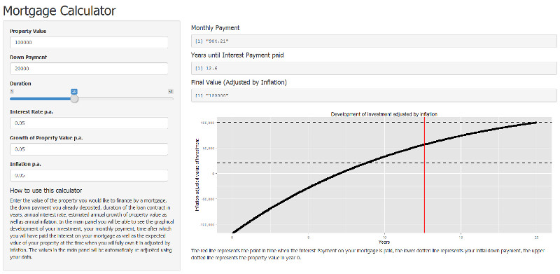

---
title       : Mortgage Calculator
subtitle    : Reproducible Pitch Presentation 
author      : Andrej Mihálik
job         : 
framework   : html5slides       # {io2012, html5slides, shower, dzslides, ...}
highlighter : highlight.js  # {highlight.js, prettify, highlight}
hitheme     : tomorrow      # 
widgets     : [mathjax, quiz]            # {mathjax, quiz, bootstrap}
mode        : selfcontained # {standalone, draft}
--- .class #mainslide

# Mortgage Calculator

# Mortgage Calculator
## (Reproducible Pitch Presentation)

## by Andrej Mihálik

--- .testing #secondslide

## Slide 2

Imagine you have a mortgage loan contract for a property of a value of $€ \ 100\ 000$ and a down payment of $€\ 20\ 000$ at a $5\%$ interest rate.

You are offered two payment plans, one in which you pay regular monthly payment of $€\ 904.21$ and the other with monthly payments of $€\ 925.77$.
 
If the conditions of your contract remain unchanged, if you choose the lower monthly rates, how much longer will be the duration of your mortgage?

--- .testing #secondslide

## Slide 2

This slight increase of your monthly payments at about $€\ 21.56$ per month would save you **4 years**.

To make informed decisions about your mortgage you need the maths. The **mortgage calculator** will do it for you **for free**!

It allows you to:

- **find** the mortgage **plan best suited** to your long-term interest
- **compare** mortgage plans with different conditions
- simulate the development of your mortgage under different scenarios, so that it is easier for you to **consider the potential risks**

--- .testing #thirdslide

## How it works?

You enter all the basic data of your mortgage contract into this simple form and the rest is calculated for you automatically:



--- .testing #thirdslide

## A Sample Calculation

Let me now present you the calculation for monthly payments used in Mortgage Calculator in R:


```r
property.value <- 100000
downpayment <- 20000
interest.rate <- 0.05
duration <- 20

mortgage <- property.value - downpayment  
interest.payment <- mortgage * ((1 + interest.rate/12)^(12*duration)-1)
payment <- (mortgage + interest.payment)/(duration*12)

print(payment)
```

```
## [1] 904.2134
```

